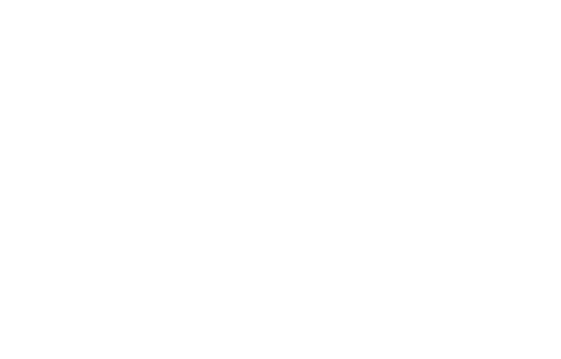

# Makerspace Arcade
A Makerspace project for an arcade machine in the school

### Description
This is the main software of the arcade machine, which controls
all games and provides a menu. The gaming machine is a project of the 
Makerspace for the Bodensee Gymnasium Lindau in Germany.

### Homepage
https://arcade.bodensee-gymnasium.de

### Trailer
https://www.youtube.com/watch?v=8V85Eo9Pjnc

### Details
Version: 1.3.0\
Author: Makerspace\
Framework: Nikocraft (v0.0.4)\
Database: Lernplattform Mebis Bayern (Moodle)

### Team
Management: Dr. Andre Scherl\
Software: Nikolas Beyer ([Nikogenia](https://github.com/Nikogenia))\
Hardware: Valentin Sutter ([Valis World](https://github.com/Valis-World))\
Games: Makerspace (see [catalog](https://arcade.bodensee-gymnasium.de/spiele))

\
**© 2024 Bodensee-Gymnasium Lindau**\

